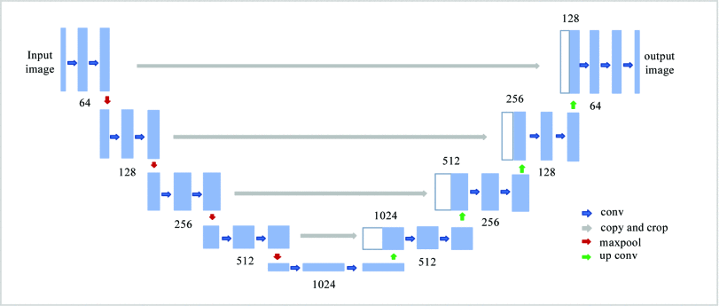
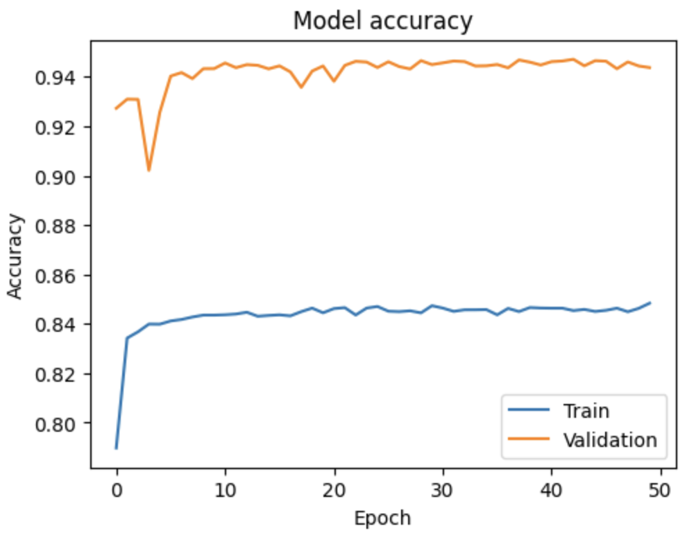
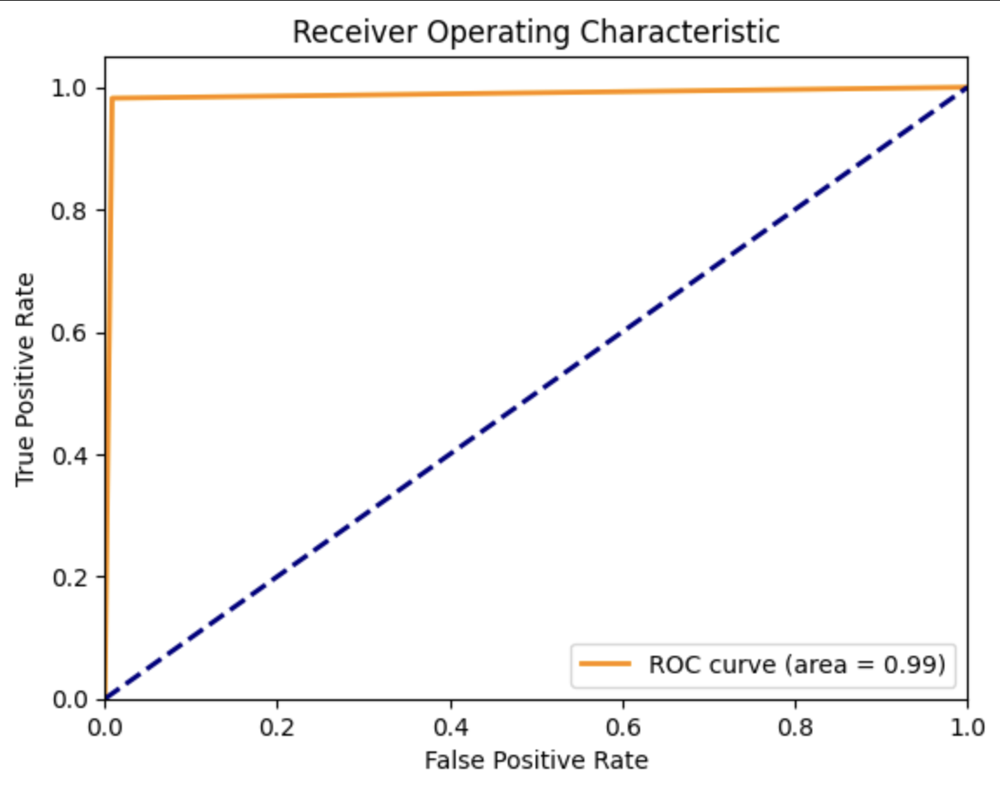
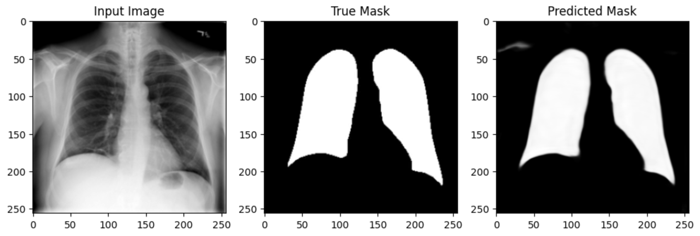

## Lung Mask Segmentation with U-Net

## Project Overview

This project implements a U-Net model for the semantic segmentation of chest X-ray images to accurately delineate lung boundaries. By leveraging deep learning techniques, the project aims to enhance diagnostic accuracy and streamline clinical workflows in respiratory care. The U-Net model is trained on a comprehensive dataset of lung images, facilitating the development of precise lung masks that assist clinicians in analyzing lung anatomy and pathology efficiently.

## Features

- **U-Net Model Architecture**: A robust U-Net model tailored for lung segmentation, featuring Gaussian noise and dropout layers for enhanced robustness and performance.
- **Data Augmentation**: Employs rotation, shifting, zoom, and brightness adjustments to enrich the training dataset and improve model generalization.
- **Comprehensive Evaluation Metrics**: Utilizes metrics such as Intersection over Union (IoU), Dice Coefficient, Precision, Recall, and Area Under Curve (AUC) for detailed model assessment.

## Installation

To run this project locally, follow these steps:

1. **Clone the repository**:
   ```bash
   git clone https://github.com/yourusername/lung-mask-segmentation-u-net.git
   cd lung-mask-segmentation-u-net
   
## Dataset Setup in Google Colab

To set up the Lung Mask Image Dataset in Google Colab, follow these steps:

- **Install the Kaggle API**: Use `!pip install kaggle` to install the Kaggle package needed for accessing the dataset.
- **Upload and Configure Kaggle API Token**: Upload your `kaggle.json` file containing your API credentials to Colab, then move it to the correct location with appropriate permissions to authenticate your session.
- **Download and Extract the Dataset**: Use the Kaggle command `!kaggle datasets download -d newra008/lung-mask-image-dataset` to download the dataset, and then extract it into a directory named `lung_mask_dataset` using `!unzip`.

Dataset link: [Kaggle Dataset](https://www.kaggle.com/datasets/newra008/lung-mask-image-dataset/data)

## Data Preparation

After setting up the dataset, a custom data generator is implemented to facilitate real-time data augmentation and sampling for training, validation, and testing sets. The custom data generator:

- **Defines directories** for training, validation, and testing image and mask datasets.
- **Configures image size and batch size**: Images are resized to 256x256 pixels, with a batch size of 8 to optimize performance.
- **Augmentation settings**: For training, images and masks are randomly augmented to include rotations, width and height shifts, zoom, and brightness adjustments to enhance the model's ability to generalize from the training data.
- **Generates batches**: Randomly samples images and masks to create batches, applying the specified augmentations and normalizing the data.

This setup not only prepares the data for effective model training but also simulates various real-world variations, improving the robustness and accuracy of the segmentation model.   

## Methodology

### A. Model Architecture: U-Net

The U-Net model is a convolutional neural network (CNN) designed specifically for biomedical image segmentation. Introduced by Olaf Ronneberger, Philipp Fischer, and Thomas Brox in 2015, the U-Net architecture consists of a symmetric encoder-decoder structure with skip connections to merge low-level and high-level features.

 <!-- Replace with the actual path to your U-Net image -->

The architecture used in this study includes several enhancements for improved performance and robustness:

1. **Encoder (Contracting Path)**: The encoder captures the context of the input image through convolutional operations and downsampling steps.

   - **Input Layer**:
     - Input size: 256x256x1 (grayscale images).
     - Gaussian noise added to the input to improve robustness.

   - **Encoder Blocks**: Each encoder block consists of:
     - Two 3x3 convolutional layers with increasing filters (32, 64, 128, 256), ReLU activation, and 'same' padding.
     - Batch normalization after each convolutional layer.
     - 2x2 max-pooling layer for downsampling.
     - SpatialDropout2D layer for regularization.

2. **Bottleneck**: The bottleneck captures the most abstract features:
   - Two 3x3 convolutional layers with 512 filters, ReLU activation, and 'same' padding.
   - Batch normalization after each convolutional layer.

3. **Decoder (Expansive Path)**: The decoder reconstructs the spatial resolution of the input image by upsampling and concatenating with corresponding encoder layers via skip connections.

   - **Decoder Blocks**: Each decoder block consists of:
     - 2x2 up-convolution (transpose convolution) layer with decreasing filters (256, 128, 64, 32).
     - Concatenation with the corresponding encoder block output.
     - Two 3x3 convolutional layers with matching filters, ReLU activation, and 'same' padding.
     - Batch normalization after each convolutional layer.

   - **Output Layer**:
     - 1x1 convolutional layer with a single filter and sigmoid activation to produce the binary segmentation mask.

4. **Skip Connections**: Skip connections link each encoder block to the corresponding decoder block, helping to retain spatial information lost during downsampling in the encoder, thus improving the localization accuracy of the segmentation.

5. **New Features and Enhancements**: Several enhancements have been implemented to improve performance and robustness:

   - **Gaussian Noise Layer**: Adds random noise to the input images during training, acting as a regularization technique. This helps the model generalize better by preventing overfitting and making it more robust to variations in the input data.

   - **Batch Normalization**: Normalizes the activations of each layer to have a mean of zero and a standard deviation of one. This speeds up training, stabilizes the learning process, and allows the use of higher learning rates, resulting in improved convergence.

   - **Spatial Dropout**: Randomly drops entire feature maps during training. This provides stronger regularization compared to standard dropout by reducing spatial correlation between feature maps, which helps prevent overfitting.

   - **Kernel Regularization (L2)**: Adds a penalty term to the loss function based on the L2 norm of the weights. This helps prevent overfitting by constraining the magnitude of the weights, leading to a simpler model with better generalization capabilities.

   - **Custom Learning Rate (Adam Optimizer)**: Utilizes the Adam optimizer with a specified learning rate. Adam combines the advantages of both the AdaGrad and RMSProp algorithms to provide an optimization technique that is well-suited for training deep neural networks, ensuring efficient and effective convergence.
  
## Training Procedure

To train the U-Net model for lung segmentation, the following hyperparameters and strategies were utilized:

### Hyperparameters

- **Learning Rate**: Set to \(1 \times 10^{-4}\), allowing gradual and precise updates to model weights.
- **Batch Size**: 8, chosen to fit the training data into memory efficiently while allowing effective gradient updates.
- **Number of Epochs**: Initially trained in multiple stages, targeting a total of 50 epochs.
- **Optimizer**: Adam optimizer, selected for its adaptive learning rate capabilities and efficiency in training deep networks.

### Callbacks

Several callbacks were implemented to enhance the training process:

- **ModelCheckpoint**: Configured to save the model weights at the end of each epoch, ensuring that the best weights are retained based on validation loss.
- **ReduceLROnPlateau**: Reduces the learning rate by a factor of 0.5 if validation loss does not improve for 5 consecutive epochs, aiding in model convergence.
- **EarlyStopping**: Monitors validation loss and stops training if there is no improvement for 5 consecutive epochs, while also restoring the best weights.

### Data Augmentation

To improve the model’s robustness and prevent overfitting, data augmentation techniques were applied:

- **Rotation Range**: Images were randomly rotated within a range of 10 degrees.
- **Width and Height Shift Range**: Images were shifted horizontally and vertically by 5% of their total width or height.
- **Zoom Range**: Images were zoomed in and out by 10%.
- **Brightness Range**: Adjusted brightness within a range of 0.8 to 1.2.
- **Fill Mode**: Used 'nearest' fill mode to handle any missing pixels created by transformations.

These augmentation techniques help create a more diverse training dataset, enhancing the model's generalization to unseen data.

By combining these strategies, the goal was to develop a robust and efficient U-Net model capable of accurately segmenting lung areas in medical images.

## Evaluation Metrics

The performance of the U-Net model for lung segmentation was assessed using several evaluation metrics to ensure accuracy and robustness. These metrics include:

- **Confusion Matrix**: Provides a comprehensive view of model performance by detailing true positives (TP), true negatives (TN), false positives (FP), and false negatives (FN).

- **Accuracy**: The ratio of correctly predicted pixels to the total number of pixels, indicating the overall correctness of the model's predictions.       
  Accuracy = (TP + TN) / (TP + TN + FP + FN)

- **Loss**: Measures the difference between predicted and actual outputs using Binary Cross-Entropy, guiding the optimization process.          
  BCE Loss = -(1/N) * Σ[yi * log(pi) + (1 - yi) * log(1 - pi)]
  
- **Precision**: The ratio of true positives to the sum of true positives and false positives, indicating accuracy in identifying positive instances.       
  Precision = TP / (TP + FP)

  
- **Recall**: The ratio of true positives to the sum of true positives and false negatives, measuring the ability to identify all relevant instances.
  Recall = TP / (TP + FN)

- **F1 Score**: The harmonic mean of precision and recall, balancing the trade-off between them.
  F1 Score = 2 * (Precision * Recall) / (Precision + Recall)


- **Mean Intersection over Union (MeanIoU)**: Measures overlap between predicted and ground truth masks, robust for evaluating segmentation performance.

  IoU = TP / (TP + FP + FN)
  MeanIoU = (1/C) * Σ IoUc


- **Dice Coefficient**: Measures overlap between predicted and ground truth masks, useful for maximizing overlap in segmentation tasks.

  Dice Coefficient = 2 * TP / (2 * TP + FP + FN)

  ## Results

### Training and Validation Performance

The U-Net model's training and validation performance was monitored over 50 epochs, with key metrics plotted to visualize the training process:

- **Loss**: Both training and validation loss showed a significant decline, with training loss starting strong and both aligning closely by the end, indicating effective learning and minimal overfitting. The close proximity of the validation loss curve to the training loss curve throughout the process underscores the model’s capability to generalize well across both datasets.

 <!-- Replace with the actual path to your loss chart image -->

- **Accuracy**: Training accuracy began at around 80% and stabilized at 84%, while validation accuracy quickly surpassed 90% and stabilized around 94%, demonstrating strong generalization capabilities of the model on unseen data.

 <!-- Replace with the actual path to your accuracy chart image -->

### Test Performance

The model was evaluated on the test dataset with the following results:

- **Precision**: 0.974872
- **Recall**: 0.982158
- **F1 Score**: 0.978501
- **Specificity**: 0.991546
- **AUC**: 0.986852
- **IoU**: 0.957907
- **Dice Coefficient**: 0.978501

These metrics suggest high performance, with the model effectively identifying true positives and minimizing false negatives in lung segmentation tasks.

### Confusion Matrix

The confusion matrix from the test dataset provided a detailed breakdown, showing a high number of true positives and true negatives, with relatively low false positive and false negative counts:

|                     | Predicted Positive | Predicted Negative |
|---------------------|--------------------|--------------------|
| **Actual Positive** | 102,883,876        | 877,213            |
| **Actual Negative** | 618,257            | 34,032,686         |

### ROC Curve

The ROC curve demonstrated the model's excellent performance, with an AUC value of 0.986852 indicating high sensitivity and specificity.

 <!-- Replace with the actual path to your ROC curve image -->


## Sample Predictions

Visualizations of sample predictions compared to the ground truth masks are shown in Figure 6. These visualizations highlight the U-Net model’s capability to accurately segment lung regions in chest X-ray images. The input image, true mask, and predicted mask are displayed side-by-side, demonstrating the close alignment between the predicted and actual masks.

 <!-- Replace with the actual path to your sample predictions image -->

The detailed analysis of the test performance, confusion matrix, ROC curve, and sample predictions underscores the U-Net model’s robust performance and its effectiveness in lung segmentation tasks. The model's high accuracy, precision, recall, and AUC values confirm its capability to generalize well on unseen data and accurately predict lung regions in medical images.

## Conclusion

This study successfully implemented an enhanced U-Net model for automated lung segmentation in chest X-ray images, demonstrating its effectiveness through high precision (0.974872), recall (0.982158), and robust generalization capabilities across various metrics. The model integrates Gaussian noise, batch normalization, spatial dropout, and L2 regularization to achieve significant improvements over traditional methods and related studies that use Inception blocks and MobileNetV2.

### Strengths
- **High Precision and Robustness**: The model consistently delivers high precision, showcasing its ability to accurately segment lung regions.
- **Effective Overfitting Prevention**: Incorporation of dropout and regularization techniques ensures minimal overfitting, supported by stable convergence of loss and accuracy metrics during training.
- **Significant Potential for Clinical Impact**: The U-Net model’s performance and adaptability suggest a strong potential for deployment in clinical settings to aid in diagnostics.

### Limitations
- **Computational Constraints**: The requirement for smaller batch sizes due to computational limits may affect the efficiency of training.
- **Need for Further Testing**: Additional testing on more diverse datasets is necessary to confirm the model’s generalizability and robustness across different clinical scenarios.

This research underscores the potential of advanced segmentation techniques in improving medical imaging analysis, paving the way for more accurate and reliable diagnostic tools.


For direct communication, you can reach me at [cobo.arnold@gmail.com](mailto:cobo.arnold@gmail.com).


